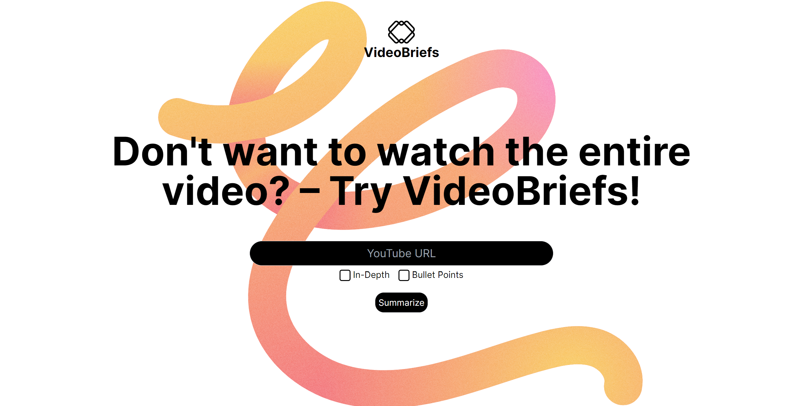

```diff 
- [ OPENAI API LIMIT EXHAUSTED ]
```

# VideoBriefs

VideoBriefs is a powerful web application that leverages the OpenAI API to simplify and enhance your YouTube video consumption experience. Built with Next.js, VideoBriefs allows users to quickly generate concise summaries of YouTube videos with just one click. Say goodbye to long-winded videos and hello to instant knowledge.



## Features

- **Summarize Videos:** Extract key insights and highlights from YouTube videos effortlessly.
- **Next.js Powered:** Built on the Next.js framework for a seamless and performant web experience.
- **OpenAI Integration:** Harness the power of OpenAI API to generate intelligent and context-aware video summaries.
- **User-Friendly Interface:** Intuitive design that makes video summarization accessible to everyone.
- **Time-Saving:** Save time by getting the information you need without watching entire videos.

## Getting Started

1. **Clone the Repository:**
   ```bash
   git clone https://github.com/your-username/videobriefs.git
   cd videobriefs
   ```

2. **Install Dependencies:**
   ```bash
   npm install
   ```

3. **Set Up OpenAI API Key:**
   - Obtain an API key from OpenAI and set it up in your environment or configuration file.

4. **Run the Application:**
   ```bash
   npm run dev
   ```

5. **Visit [http://localhost:3000](http://localhost:3000) in your browser.**

## Configuration

- Set your OpenAI API key in the environment variables or configuration files.

## Usage

1. Paste the YouTube video link in the provided input field.
2. Click the "Summarize" button.
3. Enjoy a concise summary of the video's content.

## License

This project is licensed under the [MIT License](LICENSE.md).
